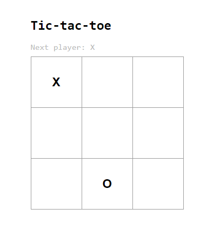

# Tic-tac-toe (Jogo da velha)
### Game

Jogo desenvolvido seguindo o "Tutorial: Introdução ao React" (presente na documentação oficial do React)



## Tech

- React
- JavaScript
- HTML5
- CSS3

## Installation

Necessitado [Node.js](https://nodejs.org/) v10+ para rodar

Você pode rodar o projeto:
```sh
cd tic-tac-toe
npm start
```

Rodando o app no development mode.\
Abra [http://localhost:3000](http://localhost:3000) para visualizar ele em seu browser.

## License

MIT

**Free Software**